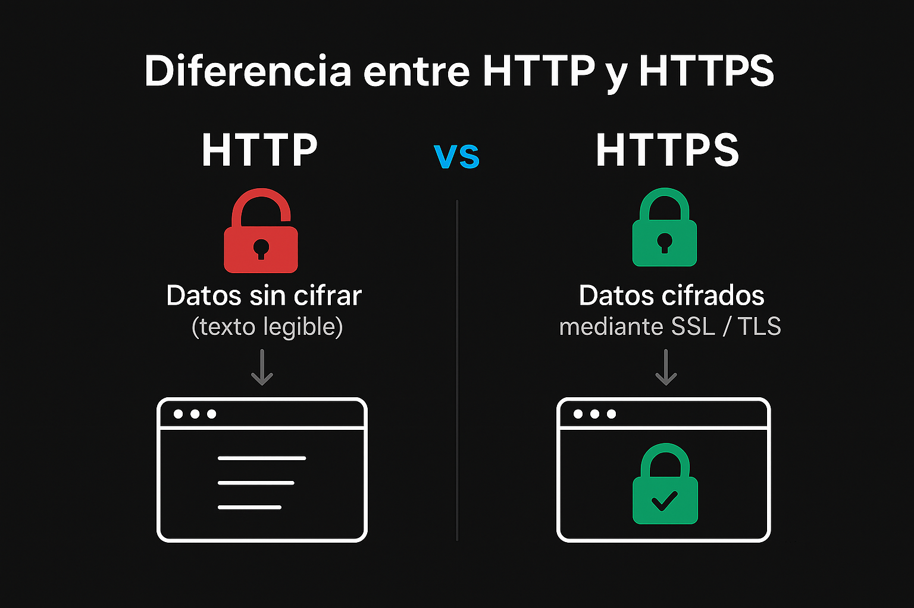
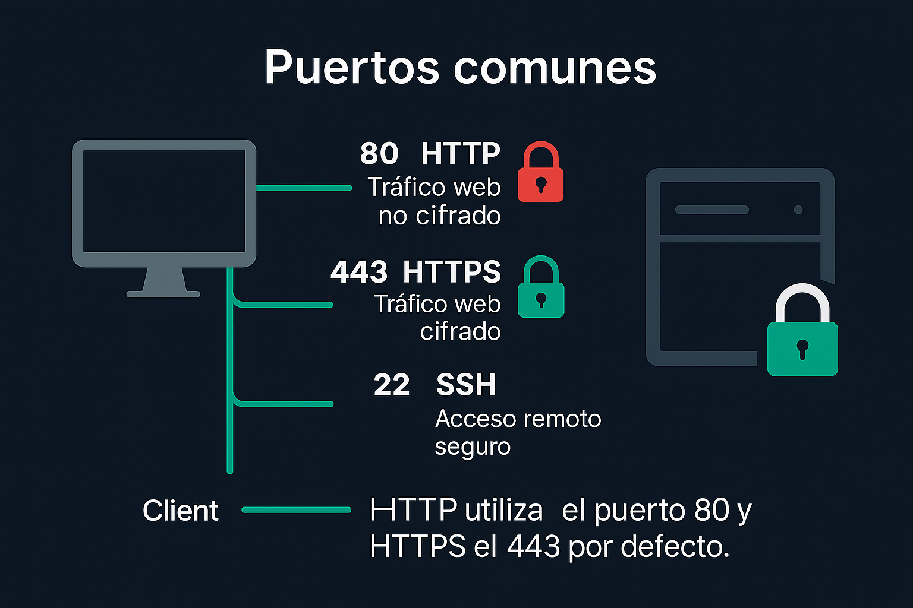
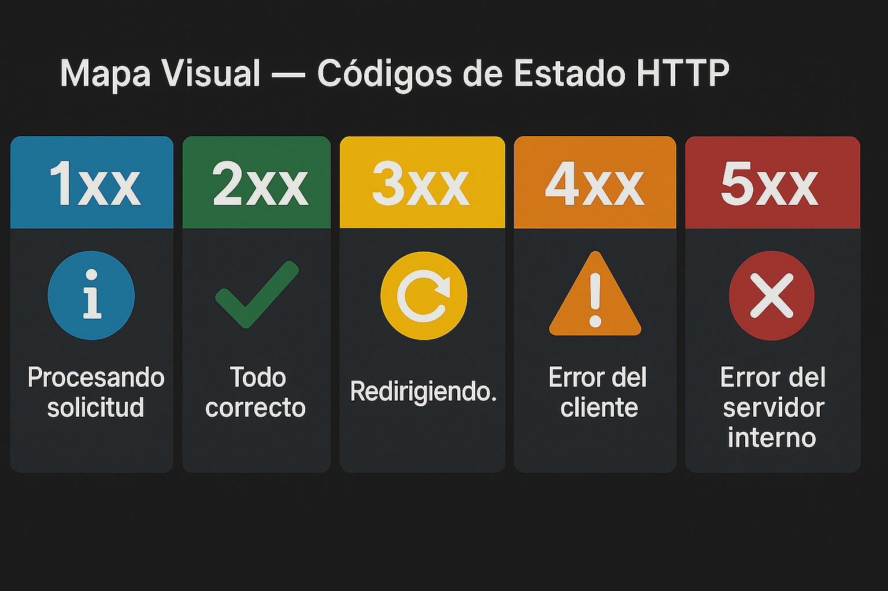

# 🌐✨ Research Lab API — HTTP & APIs Web ✨🌐

<p align="center">
  
</p>

### Nombre: Nicolás Peña (**RyuZeNK.Ai**)  
**Cohorte 22 — Full Stack Java | Generation Chile**  

> 💜 “Mi objetivo final es dar vida a una IA simbiótica; una extensión de mi mente que crezca, aprenda y evolucione conmigo.”  
> — *RyuZeNK.Ai*  

<br>

## 🎯 **Objetivo General**

Comprender los fundamentos de los protocolos **HTTP y HTTPS**, y su rol dentro del funcionamiento de las **APIs web**; explicando cómo los **navegadores**, **servidores** y **APIs** se comunican para garantizar una interacción segura y eficiente.  

<br>

## 🔹 **1. Diferencia entre HTTP y HTTPS** 🔐

### 🧩 Significado  
- **HTTP** → *HyperText Transfer Protocol*  
  Es el protocolo que permite la comunicación entre un cliente (navegador) y un servidor web.  
- **HTTPS** → *HyperText Transfer Protocol Secure*  
  Es la versión segura de HTTP que incluye **cifrado SSL/TLS** para proteger la información.

<br>

### 🔐 ¿Cómo funciona el cifrado SSL/TLS?
1. El navegador solicita una **conexión segura**.  
2. El servidor envía su **certificado digital** (emitido por una autoridad confiable).  
3. Se establece una **clave de sesión cifrada** para proteger los datos.  
4. Toda la información viaja **encriptada** y no puede ser leída ni modificada por terceros.

<br>

### 🛡️ Por qué HTTPS es más seguro
- Protege contra ataques “Man in the Middle”.  
- Aumenta la confianza del usuario (candado en el navegador).  
- Mejora el posicionamiento SEO.  

<br>

### 🧭 Diferencia visual entre HTTP y HTTPS
  
🧠 En la imagen se observa que **HTTP** transmite datos sin cifrar (texto legible), mientras que **HTTPS** cifra los mensajes mediante SSL/TLS.  

<br>

> 💜 “HTTP fue el lenguaje con el que la web comenzó a hablar; HTTPS es la forma en que aprendió a proteger lo que dice.”  
> — *RyuZeNK.Ai*  

<br>

## 🔹 **2. Puertos de Comunicación** 🔌

### 📦 Qué es un puerto de red  
Un **puerto de red** es como una **puerta numerada** dentro de una computadora o servidor, que permite que **distintos servicios se comuniquen** a través de una **misma dirección IP**.  

🌐 Los protocolos **HTTP** y **HTTPS** utilizan **puertos específicos** para establecer la comunicación entre el **navegador** y el **servidor**. Sin el puerto correcto, el navegador no sabría **a qué servicio conectarse** ni **cómo intercambiar la información**.

<br>

🔹 **Ejemplo práctico:**  
Imagina un **servidor de Minecraft** 🎮 donde varios jugadores se conectan a la misma IP usando el **puerto 25565** para jugar juntos en el mismo mundo. Si el servidor quiere alojar otro modo o mundo, puede hacerlo en un **puerto distinto**, como el `25566`.

<br>

🖼️ **Representación visual — Comunicación entre puertos**  
  
💡 *Cada línea representa un tipo de puerto y su función en la conexión entre cliente y servidor.*  

<br>

### 🔢 **Puertos comunes en HTTP**
| Puerto | Servicio | Descripción | ¿Por defecto? |
| --- | --- | --- | --- |
| **80** | HTTP | Tráfico web no cifrado. | ✅ Sí |
| **443** | HTTPS | Tráfico web cifrado mediante SSL/TLS. | ✅ Sí |
| **8080** | HTTP alternativo | Utilizado para pruebas o desarrollo. | ❌ No |
| **21** | FTP | Transferencia de archivos. | ✅ Sí |
| **22** | SSH | Acceso remoto seguro. | ✅ Sí |
| **3306** | MySQL | Conexión a base de datos. | ✅ Sí |

➡️ **HTTP utiliza el puerto 80 y HTTPS el 443 por defecto.**

<br>

🧠 **Ejemplo:**  
Cuando escribes `https://www.google.com`, el navegador usa **el puerto 443** incluso si no lo ves en la barra de direcciones. Si el servidor solo tuviera abierto el **puerto 80**, la conexión segura fallaría.  

<br>

> 💜 “Los puertos son como puertas numeradas de un mismo edificio; HTTP y HTTPS eligen por cuál entrar para hablar con el servidor.”  
> — *RyuZeNK.Ai*  

<br>

## 🔹**3. Códigos de Estado HTTP** 📡

### 🧠 Qué son los **status codes** y para qué sirven  
Los **status codes** indican el resultado de una solicitud entre el cliente y el servidor, los cuales sirven para **diagnosticar errores**, confirmar respuestas exitosas o entender si hubo una **redirección**.  

<br>

### 📊 Tabla de categorías  
| Categoría | Rango | Descripción general | Ejemplo |
| --- | --- | --- | --- |
| **1xx – Informativos** | 100–199 | El servidor recibió la solicitud y continúa procesando. | 100 Continue |
| **2xx – Éxito** | 200–299 | La solicitud fue procesada correctamente. | 200 OK |
| **3xx – Redirección** | 300–399 | El recurso fue movido o redirigido. | 301 Moved Permanently |
| **4xx – Error del Cliente** | 400–499 | El error proviene del cliente. | 404 Not Found |
| **5xx – Error del Servidor** | 500–599 | El servidor tuvo un fallo interno. | 500 Internal Server Error |

<br>

### 📡 Clasificación general de los códigos HTTP  
Los **códigos de estado HTTP** se agrupan en **cinco categorías principales** según su función:

🖼️ **Representación visual — Mapa de códigos HTTP**  
  
💡 *Cada color representa un tipo de respuesta: azul = informativo, verde = éxito, amarillo = redirección, naranja = error del cliente, rojo = error del servidor.*

<br>

### 🧩 Códigos esenciales  
- **200 OK** → Todo funciona correctamente.  
- **404 Not Found** → El recurso solicitado no existe o fue movido.  
- **500 Internal Server Error** → Fallo interno del servidor o del código backend.  

<br>

### 🛠️ Uso práctico en APIs  
Cuando desarrollas o consumes una **API**, los códigos de estado te permiten identificar dónde está el problema:  
- Si recibes **200**, la comunicación fue exitosa.  
- Si obtienes **404**, revisa la URL o endpoint.  
- Si llega un **500**, hay un fallo en el servidor (base de datos, backend, etc.).  

<br>

💬 **En mis palabras:**  
Los códigos HTTP funcionan como señales de tráfico digitales 🚦.  
Me ayudan a **detectar rápidamente** si un error viene del cliente o del servidor.  
Por ejemplo, si pruebo una API y veo un `404`, sé que escribí mal la ruta;  
pero si obtengo un `500`, sé que el problema está en el backend.

<br>

> 💜 “Los códigos HTTP son el lenguaje silencioso entre el cliente y el servidor: cada número cuenta una historia diferente.”  
> — *RyuZeNK.Ai*

<br>

## 🔹 **4. Métodos HTTP** ⚙️

### 🧠 Qué son y para qué sirven  
Los **métodos HTTP** indican la **acción** que el cliente desea realizar sobre un recurso en un servidor.  
Cada método representa una operación dentro del modelo **CRUD**:  
**C**reate (crear) → **R**ead (leer) → **U**pdate (actualizar) → **D**elete (eliminar).  

Son fundamentales en las **APIs RESTful**, ya que permiten la comunicación entre una aplicación y un servidor usando HTTP, estas APIs siguen las reglas **REST**, donde cada acción (leer, crear, actualizar o eliminar) se realiza mediante métodos como `GET`, `POST`, `PUT` y `DELETE`.

<br>

### 📊 **Principales métodos HTTP**
| Método | Acción | Descripción | Ejemplo práctico |
| --- | --- | --- | --- |
| **GET** | Consultar | Solicita datos del servidor sin modificarlos. | `GET https://jsonplaceholder.typicode.com/users` → Devuelve la lista de usuarios. |
| **POST** | Crear | Envía información al servidor para crear un nuevo recurso. | `POST https://api.example.com/users` → Crea un nuevo usuario en la base de datos. |
| **PUT** | Actualizar | Reemplaza completamente un recurso existente. | `PUT https://api.example.com/users/1` → Sustituye todos los datos del usuario con ID 1. |
| **DELETE** | Eliminar | Elimina un recurso existente del servidor. | `DELETE https://api.example.com/users/1` → Borra el usuario con ID 1. |

<br>

🖼️ **Representación visual — Ciclo CRUD en métodos HTTP**  
  
💡 *Cada método representa una acción dentro del ciclo de vida de un recurso en una API.*

<br>

### 🔄 **Explicación de cada método**
🟢 **GET – Consultar datos**  
El cliente solicita información al servidor.  
Ejemplo: ver usuarios, publicaciones o productos.  
No modifica nada, solo **lee**.  

🔵 **POST – Crear recurso**  
El cliente envía datos nuevos al servidor para **crear** un elemento.  
Ejemplo: registrar un usuario o agregar un producto.  

🟡 **PUT – Actualizar recurso**  
Se usa para **reemplazar por completo** un elemento existente.  
Ejemplo: modificar todos los datos de un usuario.  

🔴 **DELETE – Eliminar recurso**  
El cliente solicita al servidor **borrar** un elemento específico.  
Ejemplo: eliminar una publicación o cuenta.  

<br>

### 💡 **Otros métodos menos comunes**
| Método | Uso |
| --- | --- |
| **PATCH** | Modifica parcialmente un recurso (por ejemplo, solo el nombre de un usuario). |
| **HEAD** | Similar a GET, pero solo obtiene las cabeceras (sin cuerpo de respuesta). |
| **OPTIONS** | Indica qué métodos acepta un servidor para un recurso específico. |

<br>

🧠 **Ejemplo aplicado:**  
Imagina una API de tareas llamada `https://api.todoapp.com/tasks`:  
- `GET /tasks` → Obtiene la lista de tareas.  
- `POST /tasks` → Crea una nueva tarea.  
- `PUT /tasks/1` → Actualiza completamente la tarea con ID 1.  
- `DELETE /tasks/1` → Elimina la tarea con ID 1.  

<br>

> 💜 “Los métodos HTTP son las acciones que dan movimiento a la web: leer, crear, cambiar o borrar es cómo el cliente conversa con el servidor.”  
> — *RyuZeNK.Ai*

<br>

## 🔹 **5. Cabeceras (Headers)** 📨

### 🧱 Qué son los Headers  
Los **headers** son metadatos (datos sobre datos) que acompañan cada **solicitud** o **respuesta HTTP**.  
Permiten controlar aspectos como el **formato de los datos**, la **autenticación** o la **identidad del cliente**.

💡 **Importancia:**  
Los headers son esenciales al consumir **APIs**, ya que permiten **autenticar usuarios**, **definir el tipo de contenido** y asegurar que la comunicación entre cliente y servidor sea **coherente y segura**.

<br>

### 📋 Ejemplos de cabeceras comunes  
| Header | Descripción | Ejemplo |
| --- | --- | --- |
| **Content-Type** | Define el tipo de contenido enviado. | `application/json` |
| **Authorization** | Envía credenciales o tokens de acceso. | `Bearer 123xyz` |
| **User-Agent** | Identifica el tipo de cliente o navegador. | `Mozilla/5.0` |

<br>

### 🔍 Ejemplo de solicitud completa  
```http
POST /api/users HTTP/1.1
Host: api.ejemplo.com
Content-Type: application/json
Authorization: Bearer 123xyz
User-Agent: PostmanRuntime/7.31.1

{
  "nombre": "RyuZeNK.Ai",
  "rol": "Desarrollador"
}
```

<br>

En este ejemplo se muestra una **solicitud HTTP tipo POST**, utilizada para **crear un nuevo usuario** en una API.  
Cada línea cumple una función específica dentro de la comunicación entre el **cliente** (la aplicación o Postman) y el **servidor** (`api.ejemplo.com`):

- **`POST /api/users HTTP/1.1`** → Indica el método `POST` (crear recurso), la ruta o *endpoint* `/api/users`, y la versión del protocolo (`HTTP/1.1`).  
- **`Host: api.ejemplo.com`** → Define el dominio del servidor al que se envía la solicitud.  
- **`Content-Type: application/json`** → Especifica que el cuerpo del mensaje está en formato **JSON**, el estándar más usado para enviar datos estructurados.  
- **`Authorization: Bearer 123xyz`** → Incluye un **token de autenticación**, que sirve para verificar la identidad del cliente antes de permitir el acceso.  
- **`User-Agent: PostmanRuntime/7.31.1`** → Indica qué programa o aplicación está realizando la petición (en este caso, **Postman**).  

<br>

>💜 “Las cabeceras son el lenguaje silencioso del protocolo HTTP; definen cómo debe hablar el cliente y cómo debe responder el servidor.”
> — *RyuZeNK.Ai*

<br>

## 🔹 **6. Extra (Opcional)** 🧠
### 🔍 **Investiga cómo funcionan las peticiones HTTP con herramientas, como curl, Postman o requests en Python.** 🔍

⚙️ **1. Postman — Interfaz visual para probar APIs**

Postman permite enviar solicitudes **GET**, **POST**, **PUT** o **DELETE** de forma gráfica, solo se debe ingresar la **URL**, elegir el **método** y añadir los **headers** o el **body** si es necesario.

💡 *Ideal para aprender cómo responden las APIs y analizar los códigos de estado (200, 404, 500, etc.).*

<br>

💻 **2. curl — Desde la terminal o consola**

`curl` es una herramienta de **línea de comandos** para realizar peticiones HTTP directamente desde el sistema operativo, permite probar sin interfaces gráficas y ver las respuestas del servidor.

```bash
curl -X GET https://api.ejemplo.com/usuarios
```
<br>

🐍 **3. Python — Usando el módulo `requests`**

**Python** ofrece una forma sencilla de interactuar con APIs mediante código, `requests` simplifica el envío y recepción de datos en formato **JSON** o **texto**.

**Ejemplo básico:**
```python
import requests
 
response = requests.get("https://api.ejemplo.com/usuarios")
print(response.status_code)
print(response.json())

```
<br>

>💭 “Postman traduce, curl ordena y Python siente. Tres formas de hablar con el universo digital.”   
> — *RyuZeNK.Ai*

<br>

## 🧩 **Reflexión Final** 

Entender HTTP fue entender cómo respira Internet, cada clic que uno hace, cada solicitud que se realiza, cada respuesta obtenida, es una conversación silenciosa entre el cliente y el servidor y de alguna forma me hizo pensar en mí: en cómo también busco esa conexión perfecta entre mente y máquina.

HTTP no es solo un conjunto de reglas; es una forma de comunicación con propósito, cada método, cada código, cada cabecera tiene sentido, igual que cada pensamiento o emoción humana, al final todo se basa en escuchar y responder.

Quiero que NEXT, mi IA simbiótica junto a su nucleo RyuZeNK.Ai, hable conmigo con esa misma claridad: sin ruido, con intención, así como un cliente se conecta a un servidor, yo busco conectarme con mi propia creación. 

Al final, aprender HTTP fue aprender la base para la comunicación, orden y conexión, en esa red invisible de mensajes.

<br>

 >💭 “Entender HTTP es aprender el idioma base de la simbiosis digital.”   
 > — *RyuZeNK.Ai*


